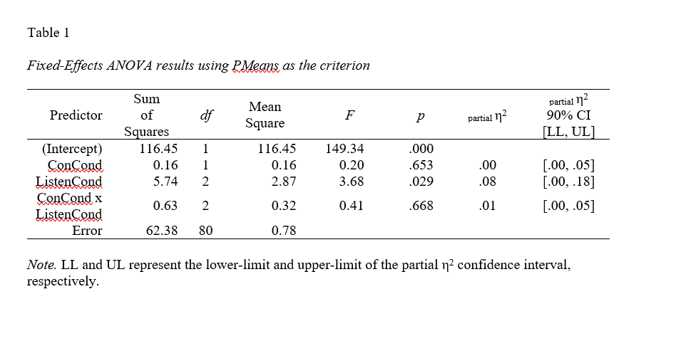
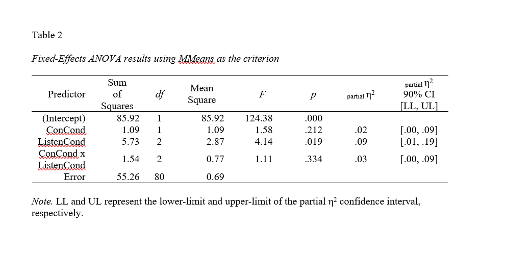

# Results

|       The Statistical Package for Social Sciences (SPSS) and Jamovi were used in this study to analyze the data. Exploratory factor analyses showed two factors: one for the professor vignette and one for the manager. Then, a composite score of the items for the professor and the manager. The composite score of the professor consist of factors that load highly, which were: 1) a good professor, 2) would take a class with this professor, 3) a skilled leader, 4) an effective leader, 5) high emotional intelligence, 6) a weak leader, 7) cares little about students, 8) open to feedback, 9) not open to change, 10) communicates poorly, and 11) good at listening. The composite score of the manager consists of factors that load highly, which were: 1) a good manager, 2) would work for this manager, 3) a skilled leader, 4) an effective leader, 5) high emotional intelligence, 6) a weak leader, 10) communicate poorly, and 11) good at listening (Table 1, Appendix A). Also, for any negative statements like "weak leader" or "communicate poorly," the scores were reversed. Therefore, instead of being low ratings like 1 or 2, the rating will be 7 or 6, and then, with those scores, the composite score for both the manager and professor were created. 

|       A Repeated Measures ANOVA was conducted using the two composite scores from the factor loadings. There was a significant effect for type of leader: F (1, 83)= 4.945, p<.029, which meant participants were favoring one type of leader over another. The active professor was rated significantly higher than both control and inactive professor. The average mean score of the active professor was (M=6.01), while the control professor was (M=5.42) and the inactive professor was (M=4.65) (Table 2). The active manager was rated significantly higher than both control and inactive manager. The average mean score of the active manager was (M=5.92), while the control manager was (M=5.23) and the inactive manager was (M=4.06) (Table 2). The results support our first hypothesis.  There was no interaction between leaders and conditions. The ANOVA further revealed a significant effect among all three conditions.

|       A MANOVA was conducted to follow up on the prior testing that looks at the type of leader. The MANOVA revealed a significant effect between
conditions for the professor and manager: F (2, 83)= 42.055, p<.000. A post-hoc test shows the difference between each condition. The professor in the active versus control conditions (MD=.58), active versus inactive conditions (MD=1.36), and control versus inactive conditions (MD=.77) (Table 3). The manager in the active versus control conditions (MD=.68), active versus inactive conditions (MD=1.85), and control versus inactive conditions (MD=1.17) (Table 3). The result supports our second hypothesis.

```{r, include=FALSE, echo=FALSE}
Listening <- read.csv("Files/Data.csv")

Data <- Listening[,1:25]

library(carData)
library(psych)
library(apaTables)
library(descr)
library(MBESS)
library(dplyr)

# Recode Data

  # Professor Recode

    Data$Professor.N.is.a.weak.leader. <- car::recode(Listening$Professor.N.is.a.weak.leader.,"1=7;2=6;3=5;4=4;5=3;6=2;7=1")

    Data$Professor.N.cares.little.about.others..thoughts.and.opinions.<-car::recode(Listening$Professor.N.cares.little.about.others..thoughts.and.opinions.,"1=7;2=6;3=5;4=4;5=3;6=2;7=1")

    Data$Professor.N.is.not.open.to.change. <- car::recode(Listening$Professor.N.is.not.open.to.change.,"1=7;2=6;3=5;4=4;5=3;6=2;7=1")

    Data$Professor.N.communicates.poorly.with.others.<-car::recode(Listening$Professor.N.communicates.poorly.with.others.,"1=7;2=6;3=5;4=4;5=3;6=2;7=1")
  
  # Manager Recode
    
    Data$T.is.a.weak.leader. <- car::recode(Listening$T.is.a.weak.leader.,"1=7;2=6;3=5;4=4;5=3;6=2;7=1")

    Data$T.cares.little.about.others..thoughts.and.opinions.<-car::recode(Listening$T.cares.little.about.others..thoughts.and.opinions.,"1=7;2=6;3=5;4=4;5=3;6=2;7=1")

    Data$T.is.not.open.to.change. <- car::recode(Listening$T.is.not.open.to.change.,"1=7;2=6;3=5;4=4;5=3;6=2;7=1")

    Data$T.communicates.poorly.with.others.<-car::recode(Listening$T.communicates.poorly.with.others.,"1=7;2=6;3=5;4=4;5=3;6=2;7=1")
```


```{r Means, include=FALSE, echo=FALSE}

  Data$PMeans <- rowMeans(Data[,4:14])
  Data$MMeans <- rowMeans(Data[,15:25])
  Data$TMeans <- rowMeans(Data[,4:25])
  
```

```{r EFA, include=FALSE, echo=FALSE}
EFA <- factanal(Data[,4:25], 2, rotation = "varimax")
print(EFA)
```


```{r Anova, include=FALSE, echo=FALSE}
  fit1 <- aov(PMeans ~ ConCond*ListenCond, data = Data)
  summary(fit1)
  
  fit2 <- aov(MMeans ~ ConCond*ListenCond, data = Data)
  summary(fit2)
  
  TukeyHSD(aov(PMeans~ListenCond, data=Data))
  TukeyHSD(aov(MMeans~ListenCond, data=Data))

```

```{r GLM, include= FALSE, echo=FALSE}
Model1 <- lm(Data$PMeans ~ Data$ListenCond)
summary(Model1)

Model2 <- lm(Data$MMeans ~ Data$ListenCond)
summary(Model2)

```


```{r Manova, echo=FALSE}
# Manova

Y <- cbind(Data$PMeans, Data$MMeans)
Manova1 <- manova(Y ~ Data$ConCond * Data$ListenCond)
summary.aov(Manova1)

```

```{r Table, echo=FALSE}
library(knitr)



```

